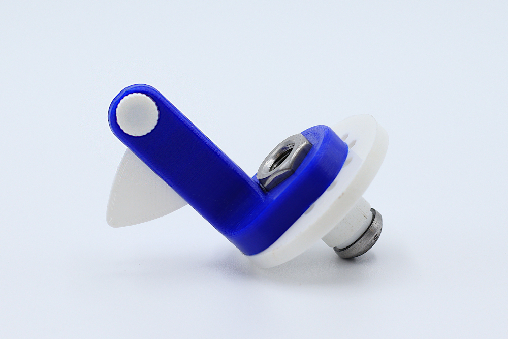
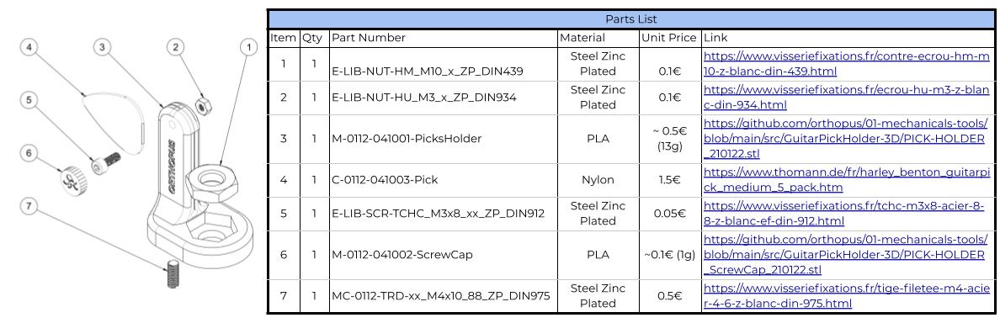
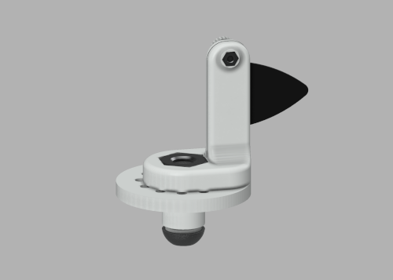
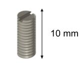
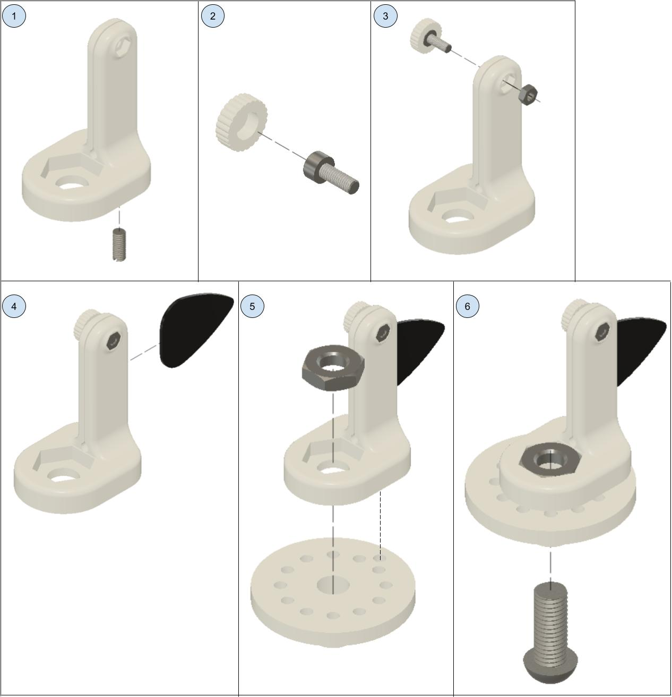

# Pick Holder 3D : Making Manual

In this manual, you will find all the resources to design the ORTHOPUS 3D printed Pick Holder.

### **List of Equipment**

**To design the Pick Holder you will need :**

- PLA type filament
- A Tool Holder 3D printed ([Making Manual](https://github.com/orthopus/01-wrist/blob/main/docs/tool-holder-3D-printer/ToolHolder_3D_making-manual.md))
- A threaded rod M4, zinc plated, DIN 975
- A screw (CHC M3x8, zinc plated, DIN 912)
- A bolt (Hu M3, zinc plated, DIN 934)

More details in the Bill of Material shown below and available with clickable links [here](https://github.com/orthopus/01-mechanicals-tools/blob/main/src/GuitarPickHolder-3D/ILL-0307-%20PickHolder3Dprinted_BoM.pdf).

**Tools :**

- A 3D Printer

- Cyanoacrylate glue (super glue)

  

### **The 3D printed body**

🧐 *Tip : open the image in a new tab to view the Pick Holder in Fusion 360 viewer*

The 3D printed body of the **Pick Holder** will firmly hold guitar picks. It will allow you through a tightening system to adjust the position and to adapt to the thickness of the guitar pick. This body needs to be connected to the **[Tool Holder 3D printed](https://github.com/orthopus/01-wrist).**

The 2 .STL file are available in [the SRC repository](https://github.com/orthopus/01-mechanicals-tools/tree/main/src/GuitarPickHolder-3D)

We used the Ultimaker Cura slicer and an Ultimaker Extended 2+ 3D printer. Following parameter were used:

- Layer height: 0.15 mm

- Infill density: 50%

- Print speed: 50 mm/s

- Fan speed: 100%

- Build plate adhesion type: Brim

  

### **Machining Operation**

To avoid the pick holder to get loose from the tool holder 3D printed, a modified threaded rod needs to be made. With a metal saw, saw a M4 threaded rod or a M4 screw to get a 10 mm threaded part. To be able to screw this threaded part inside the Pick Holder, it is necessary to make a slot at one end of it. Using the saw, make a ~1 mm deep slot to be able to use a flat screwdriver to screw the threaded part inside the Tennis Ball Holder.

You should get the following part:

### **Assembly**

- **Assembly of the pick holder 3D printed:**

1. First, insert the 10 mm long threaded rod into the 3D printed body with a flat screwdriver. 
2. Glue the head of the screw in the screw cap. 
3. Place the M3 bolt in its housing. Then insert inside the screw with the glued cap.
4. You can now insert a guitar pick in the slot. You need to adjust the position of the screw to let the pick in the slot and then to hold it firmly.

- **Assembly of the pick holder 3D printed onto the Tool Holder 3d printed:**

1. Place the M10 bolt in its housing and the 3D printed body over the Tool Holder 3D Printed (a Tool Holder 3D printed [Making Manual](https://github.com/orthopus/01-wrist/blob/main/docs/tool-holder-3D-printer/ToolHolder_3D_making-manual.md)). Be careful to place the 10 mm long threaded rod into the specific hole of the Tool Holder 3D Printed.

2. Screw the M10 modified screw in the M10 bolt.

   
   
   
