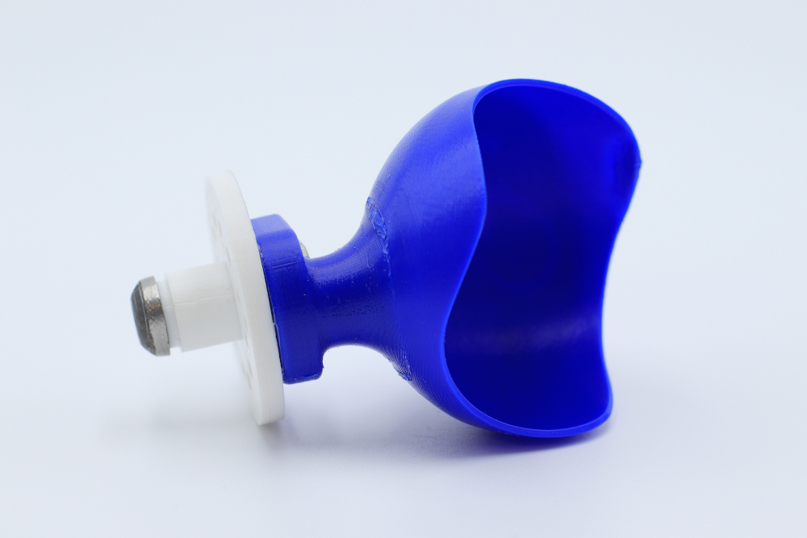
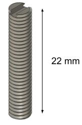
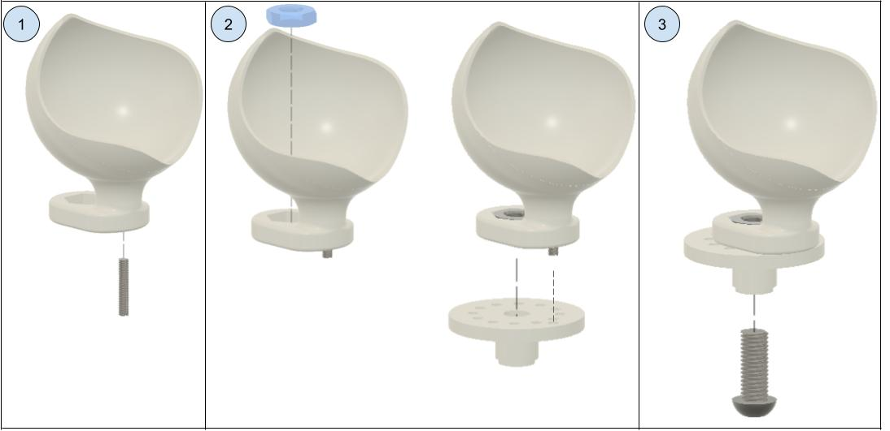

# Tennis Ball Holder : Making Manual

In this manual, you will find all the resources to design the ORTHOPUS' 3D printed Tennis Ball Holder.

### **List of Equipment**

**To design the Tennis Ball Holder you will need :**

- A 3D Printer
- PLA type filament
- A threaded rod M4, zinc plated, DIN 975
- a Tool Holder 3D printed

**Tools :** 

- A metal saw

### **The 3D printed body** 

The **Tennis Ball Holder** will house the tennis ball. It will allow you to throw the tennis ball and to serve as a pro! The 3D printed body of the Tennis ball Holder needs to be connected to the **[Tool Holder 3D printed](https://github.com/orthopus/01-wrist).** Thus, to make a Tennis Ball Holder compatible with the Universal Wrist you need to assemble the 3D printed body with a **[Tool Holder 3D printed](https://github.com/orthopus/01-wrist).**

The .STL file are available [here](https://github.com/orthopus/01-mechanicals-tools/tree/main/src/TennisBallHolder-3D)

We used the Ultimaker Cura slicer and an Ultimaker Extended 2+ 3D printer.

**Following parameter were used:**

- Layer height: 0.15 mm
- Infill density: 50%
- Print speed: 50 mm/s
- Fan speed: 100%
- Build plate adhesion type: Brim

### **Machining Operation**

To avoid the tennis ball holder to get loose from the tool holder 3D printed, a modified threaded rod needs to be made. With a metal saw, saw a M4 threaded rod or a M4 screw to get a 22 mm threaded part. To be able to screw this threaded part inside the Tennis Ball Holder, it is necessary to make a slot at one end of it. Using the saw, make a ~1 mm deep slot to be able to use a flat screwdriver to screw the threaded part inside the Tennis Ball Holder.

You should get the following part:

### **Assembly**

**Assembly of the Tennis ball holder 3D printed:**

1. First, insert the 22 mm long threaded rod into the 3D printed body with a flat screwdriver.

**Assembly of the Tennis ball holder 3D printed onto the Tool Holder 3D printed**:

1. Place the M10 bolt in its housing and the 3D printed body over the Tool Holder 3D Printed. Be careful to place the 22 mm long threaded rod into the specific hole of the Tool Holder 3D Printed.

2. Screw the M10 modified screw in the M10 bolt.

   

